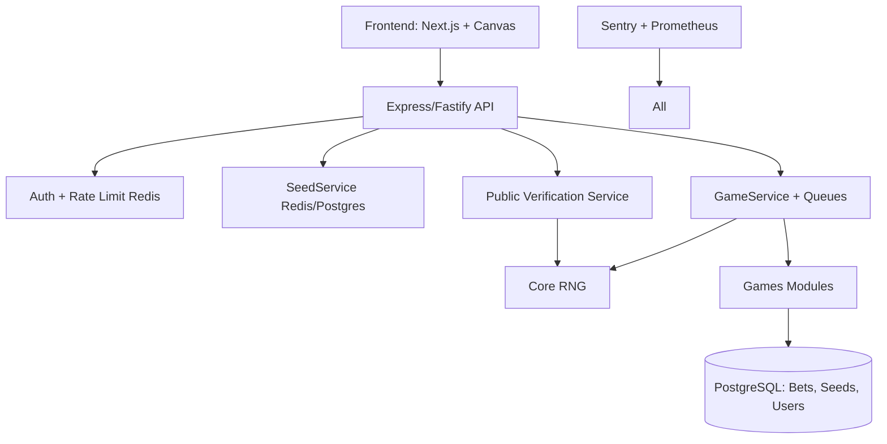

# CPlatform — Provably Fair Gaming Platform

## Project Summary

CPlatform is a provably-fair online gaming platform (Mines, Plinko, Dice, Roulette,
Keno, Blackjack, HiLo, Chicken, Darts). Every game outcome is derived from an
HMAC-SHA256 RNG seeded by a server seed (committed via a public hash before play)
and a player-chosen client seed + nonce, so any bet can be independently verified
after the server seed is revealed.

Stack: Next.js (frontend) + Express/Fastify (API) + Prisma/PostgreSQL (persistence)
+ Redis (seed/nonce state, rate limiting) + BullMQ (queues) + Zod (validation).
See `package.json` for the current dependency baseline.

## Architecture

## Roadmap

- **Phase 1 (MVP)**: Core RNG, 4 games (Mines, Plinko, Dice, Roulette), seed service, basic API/frontend.
- **Phase 2**: Remaining games (Blackjack, HiLo, Keno, Chicken, Darts), payments, auth, admin panel.
- **Phase 3**: Multiplayer, analytics, third-party fairness audit, launch.

## Orchestration (this session acts as the Master Orchestrator)

There is no separate orchestrator subagent — the main session coordinates work and
delegates to specialists via the `Agent` tool:

| Task involves... | Delegate to |
|---|---|
| RNG core, hashing, seed commitment/verification | `core-rng-specialist` |
| A specific game's outcome/payout logic | `game-logic-engineer` |
| Prisma schema, Redis seed/nonce state, API routes, transactions | `backend-integration-specialist` |
| Next.js UI, bet forms, verification page | `frontend-ui-engineer` |
| Reviewing a component for vulnerabilities/compliance gaps | `security-audit-expert` |
| Fairness/statistical tests, CI, Docker/deploy artifacts | `testing-devops-specialist` |

Each specialist has a matching skill under `.claude/skills/<name>/` with a
`references/` folder containing canonical code — read it before writing new code
for that area, and prefer extending it over re-deriving from scratch.

## Critical standing caveat: Snippets.txt overrides AI-drafted docs

Several early design docs (`1stReviewDoc.txt`, `FinalReviewDoc.txt`) claimed
Blackjack and HiLo shuffle a virtual deck via deterministic Fisher-Yates
**without replacement**. That is **incorrect** — real production code (from
`Snippets.txt`, nuts.gg) draws each card **independently, with replacement**:
one float → `Math.floor(float * 52)` → card index, repeated up to 29 times
(Blackjack) or 52 times (HiLo), with no shrinking deck. `game-logic-engineer`'s
skill carries the verbatim correct implementation. Do not "fix" it back to a
shuffle-based approach.

## Known open items (see the full project implementation plan for resolution)

- Reconcile the Zod-validated `RNGOptions` envelope (with `version`) used at the
  API boundary against the plain `{serverSeed, clientSeed, nonce}` shape consumed
  internally by game modules.
- `gameService.ts`'s dispatch table currently only wires up `mines` — the other
  8 games, and their payout/multiplier formulas, still need to be added.
- Roulette's red/black range mapping needs verification against the real
  European wheel layout during the testing phase.
- API framework choice (Express vs. Fastify vs. NestJS) is inconsistent across
  docs; `package.json` currently only depends on `express`.
