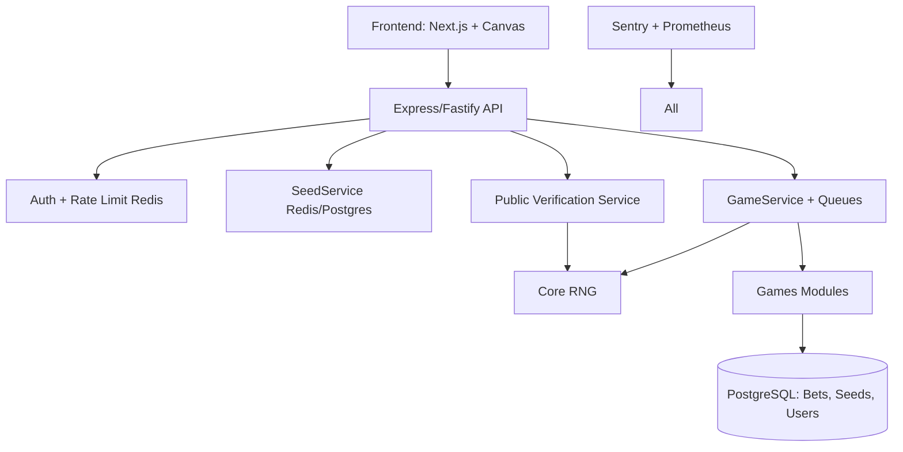

# CPlatform — Provably Fair Gaming Platform

## Project Summary

CPlatform is a provably-fair online gaming platform (Mines, Plinko, Dice, Roulette,
Keno, Blackjack, HiLo, Chicken, Darts). Every game outcome is derived from an
HMAC-SHA256 RNG seeded by a server seed (committed via a public hash before play)
and a player-chosen client seed + nonce, so any bet can be independently verified
after the server seed is revealed.

Stack: Next.js (frontend) + Express/Fastify (API) + Prisma/PostgreSQL (persistence)
+ Redis (seed/nonce state, rate limiting) + BullMQ (queues) + Zod (validation).
See `package.json` for the current dependency baseline.

## Architecture

## Roadmap

- **Phase 1 (MVP)**: Core RNG, 4 games (Mines, Plinko, Dice, Roulette), seed service, basic API/frontend.
- **Phase 2**: Remaining games (Blackjack, HiLo, Keno, Chicken, Darts), payments, auth, admin panel.
- **Phase 3**: Multiplayer, analytics, third-party fairness audit, launch.

## Orchestration (this session acts as the Master Orchestrator)

There is no separate orchestrator subagent — the main session coordinates work and
delegates to specialists via the `Agent` tool:

| Task involves... | Delegate to |
|---|---|
| RNG core, hashing, seed commitment/verification | `core-rng-specialist` |
| A specific game's outcome/payout logic | `game-logic-engineer` |
| Prisma schema, Redis seed/nonce state, API routes, transactions | `backend-integration-specialist` |
| Next.js UI, bet forms, verification page | `frontend-ui-engineer` |
| Reviewing a component for vulnerabilities/compliance gaps | `security-audit-expert` |
| Fairness/statistical tests, CI, Docker/deploy artifacts | `testing-devops-specialist` |

Each specialist has a matching skill under `.claude/skills/<name>/` with a
`references/` folder containing canonical code — read it before writing new code
for that area, and prefer extending it over re-deriving from scratch.

## Critical standing caveat: Snippets.txt overrides AI-drafted docs

Several early design docs (`1stReviewDoc.txt`, `FinalReviewDoc.txt`) claimed
Blackjack and HiLo shuffle a virtual deck via deterministic Fisher-Yates
**without replacement**. That is **incorrect** — real production code (from
`Snippets.txt`, nuts.gg) draws each card **independently, with replacement**:
one float → `Math.floor(float * 52)` → card index, repeated up to 29 times
(Blackjack) or 52 times (HiLo), with no shrinking deck. `game-logic-engineer`'s
skill carries the verbatim correct implementation. Do not "fix" it back to a
shuffle-based approach.

Scope of what's sacred: the **card-draw mechanic** above is verbatim and must not
change. The **guess/payout semantics** on top of it are our own design and were
deliberately revised during the M7 fairness pass — HiLo now uses a two-way
"higher-or-equal" (≥) / "lower-or-equal" (≤) model (not the reference's strict
three-way {higher, lower, equal}). That change is intentional: the reference's
strict model made higher-on-King / lower-on-Ace probability-0 auto-losses, which
compounded to a severe hidden edge on multi-step guesses; the ≥/≤ model keeps
every step at exactly 0.99 EV so chains telescope to 0.99ⁿ. Do not revert HiLo's
guess semantics to the reference's strict three-way version.

## House-edge conventions (design decisions to preserve)

All games target a uniform **1% house edge** (`applyHouseEdge`, RTP 0.99) with two
deliberate, documented exceptions — do not "normalize" these back to 0.99:

- **Roulette ≈ 2.7% edge (RTP 36/37 ≈ 0.973).** The single-zero (37-pocket) wheel
  provides the edge structurally, so roulette pays the real European multipliers
  (`EUROPEAN_PAYOUTS`) **without** an additional `applyHouseEdge` — layering the 1%
  on top double-counted the edge (the M7 bug fix).
- **Blackjack ≈ 0.9723 RTP.** Rule- and basic-strategy-determined, not a free
  parameter; pinned as a regression constant in its tests.

## Known open items / deferred pre-launch hardening

Resolved since early docs (no longer open): the RNGOptions envelope↔internal-shape
reconciliation (M1/M4), the full 9-game dispatch table + payout formulas (M3/M6),
roulette wheel/edge verification (M6/M7), and the API framework choice (Express, M4).

Deferred, tracked (from the M7 security & fairness audit):

- **Money is computed in IEEE-754 floats before hitting `Decimal(18,8)`** (every
  game's `payout = betAmount * multiplier`, `applyHouseEdge`, and the `Number()`
  casts on the idempotency-replay path). Real correctness/audit-integrity risk for
  a provably-fair platform, but not an exploitable vuln today. Fix before real
  money: move money math to a fixed-point/decimal representation (integer
  minor-units or `decimal.js`) and quantize to 8dp before every persist; stop
  reading `Number(existing.payout)` back into further arithmetic. Touches every
  `resolve()` return, `gameService.ts`'s transaction, and the Prisma read paths.
- **Platform bet-limit *values*.** The enforcement mechanism exists (opt-in
  `MIN_BET_AMOUNT`/`MAX_BET_AMOUNT` env, enforced in `gameService.playGame`); choosing
  actual per-game/jurisdiction limits is a product/compliance decision.
- **Auth and jurisdiction are unauthenticated header stubs** (`x-user-id`,
  `x-jurisdiction`). Every other control (balance ownership, rate limiting,
  jurisdiction gating) rests on them, so replacing them with real session identity +
  geo/KYC is the top infrastructural pre-launch blocker (Milestone 9 / payments).
- **No responsible-gaming / RTP-disclosure surface** in the frontend (no per-game
  RTP page, session/reality-check limits, or player-facing jurisdiction messaging).
  Product/compliance scope. Note the non-obvious multi-step odds worth disclosing
  (e.g. chained HiLo guesses telescope to 0.99ⁿ — a large effective edge on long
  streaks even though each step is fair).
- **Require `CORS_ORIGIN` in production** is now enforced (boot fails fast); revisit
  if a deployment needs a different origin policy.
